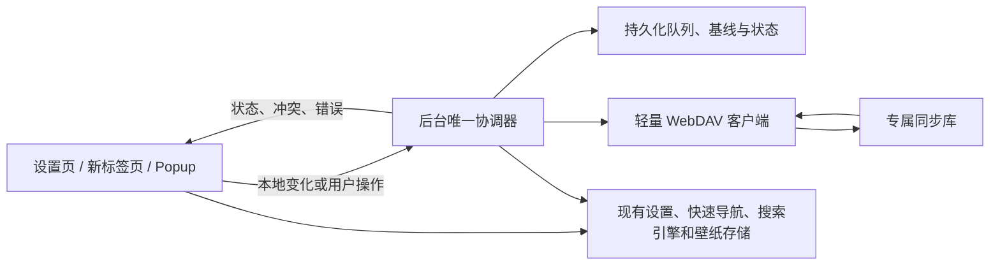
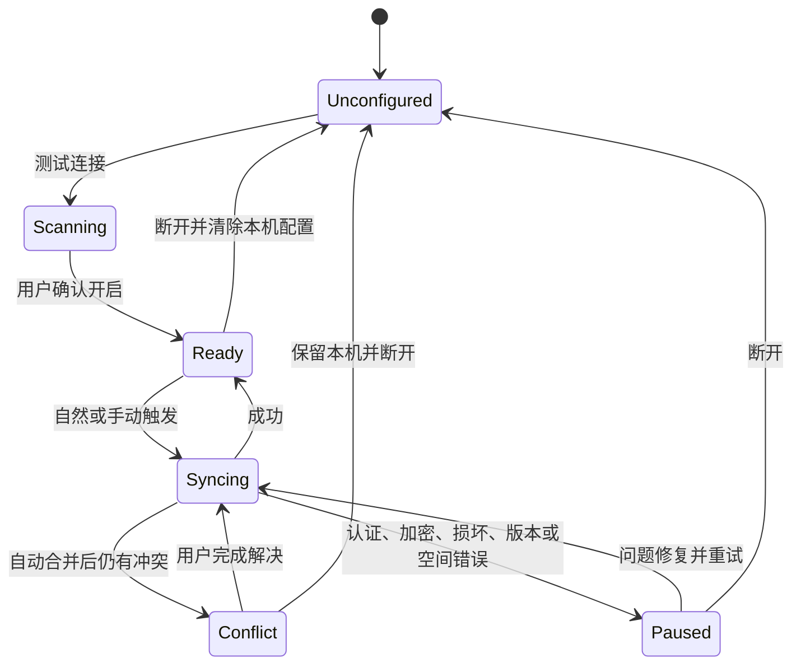

# WebDAV 双向同步与备份规格

## 0. 当前精简实现决策（优先级最高）

本节记录实施前最后确认的精简范围。它是本文其他章节的修订条款；后文与本节冲突的旧设计仅作为历史背景，不再是实现或验收要求。

- 删除搜索历史同步、壁纸压缩及替换原图、明文库转加密、修改同步加密密码、跨设备全局重置、外部公网 HTTP、安全降级双向同步和自定义备份容器。
- 同步库只有八个全局范围开关：设置、快速导航、自定义搜索引擎、语言与颜色模式、隐藏站点、当前静态图片壁纸、在线/API 壁纸地址、用户选择的图标。前四项默认开启，后四项默认关闭；远端记录完整范围，其他客户端必须先采用该范围再捕获或应用数据。
- 设置同步采用显式白名单。远端未知、未列入白名单或本地版本缺少的字段不参与应用和冲突判断；未知字段在后续提交中尽量原样保留。
- 快速导航和自定义搜索引擎只上传用户明确选择的图标，不上传自动获取或缓存图标。单个图标最多 2 MB、全部图标最多 8 MB、结构化快照最多 10 MB；单张静态壁纸最多 20 MB。超限、动画、视频或不可读资源只跳过并提示，不修改本机原文件。
- 历史数量固定最多 10 个，不向用户提供数量设置；版本和删除墓碑最多保留 180 天。当前版本和直接前一版本受保护，未解决冲突分支不参与常规清理，孤儿资源保留 24 小时后才可删除。
- 服务器必须支持可靠的条件创建和条件更新；不可靠时拒绝启用同步。HTTP 只允许经明确风险确认的局域网地址，公网地址必须使用 HTTPS。
- 本地备份只使用经过清洗和校验的 JSON，不包含凭据、同步基线、运行状态、搜索历史或壁纸文件；不再提供 `.lemon-backup` 容器。
- 加密状态和独立加密密码只在创建同步库时确定，之后不可切换或修改；忘记密码只能删除同步库。

## 1. 文档信息

| 项目            | 内容                                           |
| --------------- | ---------------------------------------------- |
| 状态            | 已确认产品决策，待进入原型与实现               |
| 目标版本        | 待定                                           |
| 功能定位        | 实验性、默认关闭的 WebDAV 双向同步与版本化备份 |
| 适用范围        | Chrome、Edge、Firefox 等当前支持的浏览器构建   |
| 当前设置 Schema | V11                                            |
| 规格格式版本    | 1                                              |

本文中的“必须”“不得”“应当”是实现与验收要求，不是可选建议。若实现阶段发现需要改变本文已确认的行为，必须先向用户说明影响并获得确认，再修改规格和代码。

## 2. 背景与现状

当前版本已移除依赖浏览器 `storage.sync` 的实验性云同步，也删除了原后台同步入口和定时调度。现有云相关代码只用于读取、下载或清理旧浏览器云端残留，不得把它误认为仍可复用的同步后端。

当前本地导出仅包含：

- `settings`
- `quickLinks`
- `customSearchEngines`

当前导入要求设置版本完全一致，缺少严格的字段校验、资源完整性校验、跨存储事务和失败恢复。新的 WebDAV 功能可以复用现有 Store 的正式读写入口和设置迁移逻辑，但不得直接复用当前“依次覆盖三个 Store”的导入流程。

## 3. 产品目标

### 3.1 必须实现

- 使用用户自己的通用 WebDAV 服务完成双向同步。
- 多设备共用一个同步库，每次提交均形成不可变版本。
- 自动合并互不重叠的修改；无法安全合并时停止同步并让用户决定。
- 任何自动应用都必须证明远端版本继承自本机已确认基线，不能依赖时间戳判断新旧。
- 同时上传、后台被终止、断网、空间不足、错误重试、文件损坏时不得静默覆盖用户数据。
- 保留有限历史，默认 10 个，可配置为 2–20 个。
- 支持当前本地图片壁纸的可选同步，不同步视频壁纸或可重新下载的缓存。
- 支持可选客户端加密，默认关闭。
- 提供易理解的配置、状态、冲突、历史、设备和危险操作界面。
- 保留并升级本地导入导出能力。
- 设置页的 `cloud-off` 图标必须与最终同步范围一致，并跟随用户的数据范围选择动态变化。

### 3.2 明确不做

- 不使用浏览器账号的 `storage.sync` 作为新功能后端。
- 不提供开发者运营的云服务、账号系统或密钥找回服务。
- 不同步浏览器书签树、原始常访问站点、浏览器权限、缓存或 WebDAV 凭据。
- 不同步视频壁纸。
- 不做固定周期轮询；尤其不增加 15 分钟定时检查。
- 不支持同时连接多个同步库。
- 第一版只支持 HTTP Basic Authentication，不实现 OAuth、Digest、NTLM 或服务商专用协议。
- 不使用“时间较新”“版本号更大”或“最后写入者获胜”作为冲突解决策略。
- 不创建可供用户恢复的本机历史副本；仅保存三方合并必需的当前同步基线。
- 不为一次性问题引入大型框架、完整 WebDAV SDK 或重复的状态抽象。

## 4. 不可违反的安全原则

1. **远端变化不得静默覆盖存在未同步修改的本机数据。**
2. **本机变化不得无条件覆盖其他设备已经提交的远端版本。**
3. **版本正文不可变。**修复、恢复、合并和重置都创建新版本，不原地修改历史正文。
4. **提交必须先资源、后正文、最后提交记录。**未被完整提交记录引用的文件只是可清理孤儿，不能被应用。
5. **DAG 是唯一事实来源。**当前版本必须通过扫描完整提交记录并计算未被引用的 head 得出。
6. **时间戳只用于展示和清理，不决定冲突胜负。**
7. **浏览器权限是设备状态，不是同步数据。**远端设置不得替用户授予权限。
8. **任何删除只能作用于带有效所有权标记的扩展专属目录。**
9. **关闭、卸载、认证失败、网络错误或目录暂时不可见不得自动删除本机或远端数据。**
10. **敏感信息不得进入日志、错误详情、设备名、普通诊断文件或本地导出。**

## 5. 术语

| 术语                 | 定义                                                   |
| -------------------- | ------------------------------------------------------ |
| 同步库 / Vault       | 一个设备组共享的 WebDAV 专属目录                       |
| 代际 / Generation    | 一套互相兼容、使用同一加密状态和格式的版本集合         |
| 版本 / Revision      | 一份不可变的完整结构化同步快照                         |
| 提交记录 / Commit    | 表明某个版本和其资源均已完整写入的最后标记             |
| DAG Head             | 未被其他版本引用为父节点的完整版本；可能暂时存在多个   |
| 同步基线 / Baseline  | 本机最后一次确认与远端一致的完整同步快照，用于三方合并 |
| 删除墓碑 / Tombstone | 表示某个稳定实体已被删除的记录，保留 180 天            |
| 核心数据             | 清洗后的设置、快速导航、自定义搜索引擎、语言和颜色模式 |
| 可选数据             | 搜索历史、隐藏常访问站点、当前本地图片壁纸             |

## 6. 总体架构



### 6.1 后台唯一协调器

- 重新建立后台入口，但不恢复旧云同步实现。
- 所有标签页和 Popup 只发送“数据已变化”“立即同步”“开始恢复”等意图，不各自上传。
- 后台保证同一浏览器配置文件内 single-flight；同一时间只能有一个网络状态变更任务。
- 每次操作使用随机 `operationId`，重复消息和后台重启必须幂等。
- 待处理快照、最近请求代次、基线、错误和暂停原因必须持久化；不能只存内存。
- 后台被终止时，不得把“正在同步”当作成功。下一自然触发必须从持久化阶段继续或安全重做。

### 6.2 不主动驻留

不使用长时间 `sleep`、页面等待、固定轮询或为等待重试而保持 Service Worker 存活。同步触发见第 13 节。

### 6.3 轻量实现

只实现实际需要的 `PROPFIND`、`MKCOL`、`GET`、`PUT` 和 `DELETE`。第一版不得引入完整 WebDAV SDK；若兼容性验证证明小型自实现不可维护，再单独提交依赖评估并征求用户确认。

## 7. WebDAV 目录与所有权

默认在用户配置的根路径下创建 `LemonNewTab/`，高级设置允许指定其他专属子目录。

建议布局：

```text
LemonNewTab/
├─ vault.json
├─ generations/
│  └─ <generationId>/
│     ├─ commits/
│     │  └─ <revisionId>.json|bin
│     ├─ revisions/
│     │  └─ <revisionId>.json|bin
│     ├─ assets/
│     │  └─ <assetId>.blob
│     └─ devices/
│        └─ <deviceId>.json|bin
└─ control/
   └─ reset.json|bin
```

### 7.1 `vault.json`

必须包含：

- 固定产品标识和所有权标记；
- 规格格式版本；
- 随机 `vaultId`；
- 当前 `generationId`；
- 加密开关和解锁所需的非敏感参数。

`vault.json` 只表示同步库身份和加密信息，首次初始化并回读验证后不再更新。当前版本不写入该文件，始终由 commit DAG 计算得出。

扩展只有在产品标识和 `vaultId` 均有效时，才可管理或删除目录内容。若目录非空但没有所有权标记，必须拒绝接管并要求用户选择其他目录。

### 7.2 不可变版本与提交记录

一个版本由两个文件构成：

1. 先写 `revisions/<revisionId>` 正文；
2. 验证正文可读取且哈希一致；
3. 最后写 `commits/<revisionId>`。

只有存在有效提交记录的版本才可见。正文上传成功但提交记录缺失时，不得应用；它会在安全清理时作为孤儿处理。

### 7.3 资源

- 图片壁纸先上传资源，校验 SHA-256，再提交引用它的版本。
- 未加密库可使用 `sha256-<digest>` 作为资源标识。
- 加密库必须使用随机或密钥化的不透明资源名，明文 SHA-256 只能存在密文正文中。
- 当前代际只保留当前被引用的浅色、深色本地图片；历史版本若引用已清理图片，必须显示“该历史壁纸未保留”。

## 8. 数据格式

### 8.1 外层提交元数据

示意结构：

```ts
interface CommitRecordV1 {
  formatVersion: 1
  vaultId: string
  generationId: string
  revisionId: string
  payloadPath: string
  payloadHash: string
  payloadSize: number
  encrypted: boolean
  complete: true
}
```

未加密库的 `payloadHash` 是正文 SHA-256；加密库的外层 `payloadHash` 只能是已存储密文字节的 SHA-256，用于传输校验，明文内容 SHA-256 必须位于密文内部。

加密库中的外层只能保留协议运行必需、且不含个人信息的随机标识与密码学参数；设备名称、时间、父版本、摘要、数据哈希和资源类型必须放入密文。

### 8.2 版本正文

```ts
interface SyncRevisionV1 {
  formatVersion: 1
  settingsSchemaVersion: number
  vaultId: string
  generationId: string
  revisionId: string
  parentRevisionIds: string[]
  operationId: string
  device: {
    id: string
    name: string
  }
  createdAt: string
  reason: 'initial' | 'local-change' | 'merge' | 'restore' | 'reset' | 'repair' | 'import'
  snapshot: SyncSnapshotV1
  tombstones: TombstoneV1[]
  assets: AssetReferenceV1[]
  snapshotHash: string
}
```

- `revisionId`、`operationId`、`generationId`、`device.id` 使用 `crypto.randomUUID()`。
- `createdAt` 仅供显示，不能参与合并胜负判断。
- 普通提交一个父版本；合并提交可包含两个或更多父版本。
- 每个版本保存完整快照，而不是依赖前一版本的增量补丁，以保证最近 2–20 个版本可独立验证和恢复。

### 8.3 同步快照

```ts
interface SyncSnapshotV1 {
  settings: SanitizedSettings
  quickLinks: SyncQuickLinksData
  customSearchEngines: SyncCustomSearchEngineData
  ui: {
    language: string
    colorMode: 'auto' | 'dark' | 'light'
  }
  optional?: {
    searchHistory?: SyncSearchHistory
    blockedTopSites?: SyncBlockedTopSites
  }
}
```

图片壁纸不塞入 JSON，不使用 Base64；快照只保存资源引用和恢复策略。

### 8.4 输入与资源上限

所有远端内容都按不可信输入处理。初始实现采用以下硬上限，未来只能通过格式版本和兼容迁移调整：

| 对象                                 | 上限                     |
| ------------------------------------ | ------------------------ |
| `vault.json`、单个提交记录或设备记录 | 256 KiB                  |
| 单个解密后结构化版本正文             | 25 MiB，不含独立壁纸资源 |
| 单个当前图片壁纸                     | 20 MiB                   |
| 单次 `PROPFIND` 响应                 | 5 MiB、最多 2,048 个条目 |
| HTTP 同源重定向                      | 最多 3 次                |
| 元数据请求                           | 30 秒超时                |
| 图片上传或下载                       | 120 秒超时               |

- 有 `Content-Length` 且已超限时立即拒绝；缺失时必须在流式读取过程中计数并中止。
- 结构化正文超限时停止提交并指出占用最大的分类或内嵌图标，不能静默丢弃字段后继续。
- 响应为压缩内容时按解压后的实际字节限制，避免压缩炸弹。
- XML 只解析所需 DAV 属性，不处理外部实体、脚本或任意深度递归。
- 超时使用 `AbortController`，但超时不能被记录为数据不存在。

## 9. 数据范围

### 9.1 默认同步

- 清洗后的 V11 设置；
- 快速导航项目、分组、顺序和内嵌图标；
- 自定义搜索引擎、顺序和图标；
- 界面语言；
- `auto` / `dark` / `light` 颜色模式。

### 9.2 默认关闭、用户可选

| 数据               | 默认 | 说明                                              |
| ------------------ | ---- | ------------------------------------------------- |
| 最近搜索记录       | 关闭 | 可能包含用户输入内容；现有最大 15 条              |
| 被隐藏的常访问站点 | 关闭 | 可能反映浏览行为                                  |
| 当前本地图片壁纸   | 关闭 | 首次开启显示浅色/深色数量与总大小；无图片时不显示 |

### 9.3 永不同步

- 浏览器书签树；
- 浏览器提供的原始常访问站点；
- 浏览器已授予的权限及站点授权状态；
- WebDAV 地址、用户名、密码、Authorization、客户端加密密码；
- 今日诗词 Token 等服务标识；
- 搜索建议内存缓存；
- IndexedDB favicon 缓存；
- Bing 壁纸文件和信息缓存；
- 在线壁纸缓存；
- Monet 派生颜色缓存；
- 一言内容缓存；
- `blob:` URL、对象 URL 和 Session Storage 派生数据；
- 通知是否展示过、更新日志是否读过、运行版本等设备状态；
- 退役浏览器云同步数据和元数据；
- WXT 内部元数据。

### 9.4 设置清洗规则

默认保留所有可移植 UI 和行为偏好，但必须特殊处理以下字段：

| 字段                                                 | 处理                                                                                                      |
| ---------------------------------------------------- | --------------------------------------------------------------------------------------------------------- |
| `settings.sync`                                      | 旧功能字段不得进入新快照；新 WebDAV 配置独立存储                                                          |
| `background.local/localDark.id`                      | 仅在图片资源成功纳入时转换为远端资源引用，否则不上传                                                      |
| `background.local/localDark.url`                     | 永久排除，禁止上传 `blob:` URL                                                                            |
| `background.bing.id/url/updateDate/cachedResolution` | 排除；只保留模式与 `resolution` 偏好                                                                      |
| `background.online.url`                              | 高级范围“在线/API 壁纸地址”默认开启；关闭时保留各设备本机值，不上传远端值；开启前提示地址可能含访问 Token |
| `background.online.cache.*`                          | 同步用户意图；实际缓存和权限保持设备本地                                                                  |
| `theme.monetColor`                                   | 同步用户意图；目标设备按权限和壁纸能力重新启用                                                            |
| `faviconCacheEnabled`                                | 同步用户意图；真实能力必须在目标设备重新授权                                                              |
| `readChangeLog` / `pluginVersion`                    | 排除                                                                                                      |
| `hideMajorChangelog`                                 | 作为用户偏好同步                                                                                          |

### 9.5 快速导航和搜索引擎图标

快速导航图标属于默认开启的高级同步范围。为避免把缓存和自动抓取内容写入 WebDAV，持久化的 `QuickLink` 必须记录 `faviconSource: 'user-selected' | 'automatic'`：

- 只有用户在快速导航编辑界面明确选择的图标标记为 `user-selected`，且仅在“快速导航内嵌图标”范围开启时上传；
- Popup、浏览器书签、常访问站点和网络抓取产生的图标标记为 `automatic`，永不上传；
- 旧版 `QuickLink.favicon` 没有来源信息，迁移时保持内容但来源留空，按来源不明处理并永不上传；用户重新选择图标后才可上传；
- 禁止按 Data URI、URL 或文件类型猜测来源；关闭该范围或恢复不含图标的快照时，保留本机已有的非同步图标，不把“快照缺失”解释为删除；
- 对允许上传的图标计算 SHA-256 并在单快照内去重，计入正文大小限制。

高级同步范围默认值：

| 范围              | 默认值 | 关闭后的行为                               |
| ----------------- | ------ | ------------------------------------------ |
| 在线/API 壁纸地址 | 开启   | 不上传或应用该地址，保留各设备本机值       |
| 快速导航内嵌图标  | 开启   | 不上传或应用任何内嵌图标，保留各设备本机值 |

## 10. 实体标识、顺序与删除墓碑

### 10.1 稳定 ID

- 现有快速导航项目缺少 ID，启用新同步前必须为每项生成 UUID 并持久化。
- 快速导航分组沿用现有稳定 ID。
- 自定义搜索引擎沿用现有 ID。
- URL 相同的两个项目不能自动视为同一实体；重复项目是允许的用户状态。

### 10.2 顺序

- 项目内容与顺序分开比较。
- 两端只修改不同项目内容时可自动合并。
- 两端同时修改同一列表顺序时，不尝试基于索引拼接；进入冲突，内容先安全合并，再让用户选择本机或远端顺序。

### 10.3 墓碑

```ts
interface TombstoneV1 {
  entityType: string
  entityId: string
  deletedByRevisionId: string
  deletedAt: string
  expiresAt: string
}
```

- 墓碑保留 180 天。
- 删除与另一端修改同一实体时视为冲突，不能默认“删除优先”或“修改优先”。
- 超过 180 天未同步的设备再次出现时，不以其旧基线增量合并，而按首次加入设备重新初始化。

## 11. 本机同步状态

独立于普通设置保存：

```ts
interface LocalSyncStateV1 {
  configured: boolean
  paused: boolean
  pauseReason?: SyncPauseReason
  vaultId?: string
  generationId?: string
  deviceId: string
  deviceName: string
  baseRevisionId?: string
  baseline?: SyncSnapshotV1
  lastSuccessAt?: string
  pending?: PendingSyncOperation
  lastError?: SanitizedSyncError
  historyLimit: number
  scope: SyncScopePreferences
  encrypted: boolean
}
```

### 11.1 基线不是恢复副本

- 本机只保存最后一次双方确认一致的基线，用于三方比较。
- 新同步成功后覆盖旧基线。
- 基线不显示在历史界面，也不能作为用户恢复来源。
- 若基线丢失或无法验证，设备必须进入首次连接流程，不能猜测祖先。

### 11.2 凭据

- WebDAV URL、用户名和密码只保存在当前浏览器配置文件。
- 默认记住，以支持后台同步；“仅本次使用”关闭后台自动同步并在会话结束后清除。
- URL 中禁止嵌入用户名和密码。
- 凭据不得进入同步快照、本地导出、日志、诊断、通知或错误消息。

## 12. 同步状态机



状态至少包含：

- 未配置；
- 扫描远端；
- 同步中；
- 已同步；
- 有待上传修改；
- 因冲突暂停；
- 因认证失败暂停；
- 等待输入加密密码；
- 因空间不足暂停；
- 因数据损坏暂停；
- 因格式过新暂停；
- 云端目录已删除；
- 壁纸未同步，但核心数据正常。

## 13. 触发与调度

### 13.1 本地变化

- 本地持久化变化停止 5 秒后发起一次同步。
- 5 秒内的多个变化合并为最后一个不可变快照。
- 多标签页变化由后台代次号收敛，旧的异步快照完成后不得覆盖新的待处理快照。
- 应用远端数据期间必须抑制回传循环，完成后再比较最终哈希。

### 13.2 自然触发

- 打开新标签页时轻量检查；
- 浏览器新会话启动时；
- 页面检测到恢复联网时；
- Popup 或设置页产生同步数据变化时；
- 用户点击“立即同步”时；
- 上一次失败后的下一自然触发。

### 13.3 禁止固定轮询

- 不创建 15 分钟 alarm。
- 不为失败启动等待计时器。
- 不要求新标签页保持打开直到重试。
- 待重试任务持久化，后台或页面结束不会丢失。

## 14. 远端扫描与基础访问探测

测试连接必须依序验证：

1. URL 和协议安全边界；
2. Basic Authentication；
3. 精确 origin 权限；
4. 目录读取和 `PROPFIND Depth: 1`；
5. 专属目录创建；
6. 随机目录和随机文件的创建、`PUT`、回读校验和枚举；
7. 删除测试文件和目录后是否恢复原状。

测试不得使用或覆盖固定的正式文件名。失败时说明用户能理解的原因，不显示 Authorization、完整查询参数或响应中的敏感正文。

### 14.1 单一追加式协议

- revision 和加密资源使用随机 UUID 路径，未加密资源可使用内容哈希路径；
- 写入顺序固定为资源、revision、commit，每次写入后立即回读并校验哈希；
- commit 永远最后写入，只有存在完整有效 commit 的 revision 对同步可见；
- 每次同步枚举全部 commit、验证 revision，并通过 `parentRevisionIds` 计算 DAG heads；
- 唯一 head 才能成为本机新基线；多个 heads 触发现有重扫与多父合并流程；
- 恢复未完成任务时，只有远端 revision 与待提交内容完全一致才复用原 ID，否则重扫并使用新 UUID。

客户端不发送版本条件请求头，也不做能力分级或模式切换。若服务器连随机文件的可靠创建、读取、枚举或删除也无法保证，只允许手动本地导出，不开启自动 WebDAV 同步。

## 15. 首次连接

### 15.1 空目录

- 展示将同步的数据范围、图片数量和预计大小；
- 用户确认后创建所有权标记、首个代际和初始版本；
- 连接测试成功不得自动上传。

### 15.2 已有同步库

- 下载、校验并解析远端格式；
- 若本机没有基线，分别展示本机与远端摘要；
- 可安全合并的内容先展示预计结果；
- 冲突项目由用户逐项选择；
- 未完成选择前不得上传或应用。

### 15.3 格式过新

旧扩展遇到无法理解的格式时：

- 停止上传和应用；
- 保留本机待同步修改；
- 提示升级扩展；
- 不忽略未知字段，不用旧格式覆盖远端。

## 16. 三方比较与自动合并

输入为：

- `base`：本机最后确认基线；
- `local`：当前本机快照；
- `remote`：远端最新完整分支。

### 16.1 基本判定

| 条件                                    | 动作                           |
| --------------------------------------- | ------------------------------ |
| `local == base` 且 `remote` 继承自基线  | 自动应用远端                   |
| `remote == base` 且本机变化             | 上传本机新版本                 |
| 两边都变化但修改路径或实体不重叠        | 自动三方合并并提交多父版本     |
| 同一字段、实体、删除/修改或顺序同时变化 | 形成冲突并停止全部上传和应用   |
| 无法验证共同祖先                        | 进入首次连接式比较，不自动覆盖 |

### 16.2 设置

- 以允许同步的叶子字段路径比较。
- 一端修改 `clock.size`、另一端修改 `search.placeholder` 可自动合并。
- 同一叶子字段双方都改且值不同必须冲突。
- 缓存指针、权限结果和设备字段在比较前已清洗，不参与冲突。

### 16.3 快速导航和自定义搜索引擎

- 按稳定实体 ID 比较创建、修改和删除。
- 不同实体的修改自动合并。
- 同一实体的不同字段可三方合并；同一字段不同值冲突。
- 列表顺序单独比较；同时排序冲突。
- “删除 vs 修改”冲突必须同时保留墓碑和修改内容，交给用户决定。
- 快速导航图标范围关闭、来源为 `automatic` 或来源不明时，该字段在比较和应用前被排除；不得因远端缺少图标而清空本机图标。

### 16.4 搜索历史与隐藏站点

- 只有用户开启对应同步范围时才参与。
- 搜索历史需记录稳定 ID 和写入时间；相同历史内容可以去重，但不得仅用设备时间决定覆盖。
- 隐藏站点按规范化 URL 集合和墓碑合并。
- 数据模型迁移若会改变现有存储结构，属于实现前需确认的复用改造，见第 31.4 节。

## 17. 冲突处理

### 17.1 顺序

1. 先自动合并所有不重叠修改；
2. 剩余无法合并项形成冲突记录；
3. 停止全部上传和自动应用；
4. 持久化本机、远端和共同祖先引用；
5. 每个浏览器会话首次发现时通知一次；
6. 设置入口持续显示“同步已暂停，有 N 项待处理”；
7. 用户打开解决界面时重新扫描远端并重新计算；
8. 解决完成后创建包含所有父分支的新合并版本；
9. 成功后把未解决分支纳入清理并恢复同步。

### 17.2 交互

- 按“设置、快速导航、搜索引擎、搜索历史、隐藏站点、壁纸”分组。
- 每项显示易读名称、本机值、远端值、设备名和展示时间。
- 支持逐项“使用本机”“使用云端”“保留两份”。
- “保留两份”只在语义允许时出现；布尔值、单选值和顺序不能伪造为两份。
- 不预选任何会丢弃一方数据的答案。
- 可提供“此分类全部使用本机/云端”，但提交前必须汇总影响并二次确认。
- 用户关闭界面后冲突永不超时，继续保持暂停。

### 17.3 分支保留

- 最多 10 个正常版本；未解决冲突分支临时不计入。
- 解决后创建合并版本，再立即按历史上限清理。
- 不创建本机恢复副本。

## 18. 下载与本机应用

### 18.1 应用前

- 验证格式版本、Schema 版本、正文 SHA-256、加密认证标签、所有引用资源的大小/MIME/SHA-256；
- 校验字段类型、枚举、长度、URL 协议、数组数量和总大小；
- 计算权限与本机能力差异；
- 构造完整目标状态，不能边下载边改 Store。

### 18.2 幂等提交

由于用户明确不保留本机恢复副本，本机应用必须使用持久化应用日志和幂等阶段：

1. 写入 `pendingApply`，记录目标版本与阶段；
2. 先暂存并验证新壁纸资源；
3. 一次性提交结构化数据；
4. 重新校验各 Store 的目标哈希；
5. 更新壁纸当前引用；
6. 更新基线和已应用版本；
7. 清除 `pendingApply`；
8. 延迟清理不再引用的本机资源。

启动流程必须在 UI 挂载前检查未完成日志并继续幂等提交。不得让应用在半套设置、半套快速导航的状态下正常启动。

若现有 Store API 无法提供所需的批量一致写入，需要改造共享导入提交模块；动手前必须按第 31.4 节先询问用户。

### 18.3 权限相关偏好

远端可以同步“希望启用”的偏好，但目标设备没有权限时：

- 不自动弹权限窗口；
- 不把实际功能标记为已启用；
- 显示“设置已同步，此设备等待授权”；
- 用户在前台点击启用时说明原因并申请；
- 拒绝授权只暂停相应功能，核心同步继续。

## 19. 图片壁纸

### 19.1 范围

- 只同步当前被设置引用的浅色、深色本地静态图片；
- 默认关闭，由首次向导主动询问；
- 视频永不上传；
- Bing、在线/API 壁纸文件永不上传，只同步可移植偏好和在线 URL；
- 每张图片最大 20 MB。

### 19.2 超过 20 MB

- 跳过该图片并继续同步核心数据；
- 持续显示“壁纸未同步：图片超过 20 MB”；
- 提供静态图片压缩入口；
- 不允许临时绕过上限。

### 19.3 压缩事务

只处理浏览器能够可靠解码的静态 JPEG、PNG、WebP、BMP、TIFF 等；GIF、APNG、动画 WebP 或无法可靠解码的格式不提供压缩。

压缩前还必须检查像素尺寸；任一边超过 16,384 像素或总像素超过 40,000,000 时，不在新标签页进程内解码压缩，只提示用户先使用本地工具缩小，避免极端图片导致内存耗尽。

1. 使用浏览器原生 `createImageBitmap` / Canvas 等能力生成候选，不新增图片压缩依赖；
2. 展示原大小、新大小、像素尺寸和预览；
3. 用户确认；
4. 暂存压缩文件；
5. 上传并校验远端 SHA-256；
6. 提交引用压缩文件的新版本；
7. 全部成功后替换本机壁纸；
8. 失败时保留原图并清理候选孤儿。

不得静默改变格式、分辨率、透明效果或动画。

### 19.4 删除远端壁纸

“停止同步壁纸并删除云端壁纸”必须：

1. 关闭壁纸同步范围；
2. 提交不再引用壁纸的新版本；
3. 验证提交成为当前版本；
4. 删除远端不再引用的壁纸；
5. 保留本机壁纸不变。

## 20. 历史与清理

### 20.1 保留数量

- 默认 10；
- 最小 2；
- 最大 20；
- 最新完整版本和至少一个上一完整版本不可同时被清理；
- 未解决冲突分支临时不计入；
- 全局重置前最后一个版本作为最近版本之一保留，不额外增加数量；
- 不提供手动“保护版本”。

调整数量前展示预计占用和将删除的版本数，确认后才执行。

### 20.2 清理顺序

1. 无提交记录的孤儿正文；
2. 无正文引用的孤儿资源；
3. 已解决冲突的多余分支；
4. 超出保留数的最旧正常版本；
5. 不再被任何保留版本引用的资源。

清理不能与上传并行；只在完整扫描得到唯一有效 DAG head 且远端集合与扫描结果一致时执行，否则延后而不是冒险删除。

### 20.3 历史恢复

- 展示设备、时间、原因、数据摘要、完整性和壁纸是否可用；
- 用户选择旧版本后，把旧内容作为新的最新版本提交；
- 不原地修改旧版本，历史内容作为新 revision 提交；
- 恢复前展示与本机当前状态的差异；
- 旧壁纸已清理时，明确说明并保留本机当前壁纸。

## 21. 重置、导入、断开与删除

### 21.1 全局同步重置

重置设置、导入整包替换或清空数据时，若同步已开启，必须询问：

- 将重置同步到其他设备；
- 仅重置本机并断开同步；
- 取消。

选择同步重置时：

- 创建新的 `generationId`；
- 写入包含新状态的重置版本和最小重置标记；
- 验证其他客户端可读取代际变化；
- 保留旧代际最后一个版本作为最近历史之一；
- 清理其余旧版本。

其他设备发现代际变化后停止同步并提供：

- 应用或安全合并新的同步数据；
- 保留本机并断开同步。

不得允许旧设备继续向旧代际上传并使已删除数据复活。

### 21.2 导入本地文件

导入前预览并提供：

- 合并到当前数据并同步；
- 用导入内容替换所有已同步数据；
- 仅导入本机并断开同步。

部分备份不能被自动理解为删除未包含分类。导入和 WebDAV 应复用同一份验证、清洗、迁移、差异和提交管线。

### 21.3 关闭同步

关闭开关即断开并清除本机 WebDAV 配置，不保留“暂停但仍配置”的普通关闭模式。弹窗使用不同视觉层级：

- 主操作：“保留云端数据并断开”；
- 危险操作：“删除云端数据并断开”。

危险操作必须要求输入指定确认文字，并显示受影响设备和版本。删除失败时保留本机连接配置以供重试，不能显示为已删除。

### 21.4 删除整个远端目录

- 只删除具有正确所有权标记的扩展专属目录；
- 删除前建议下载最新本地备份；
- 删除后本机断开；
- 其他设备发现目录不存在时立即暂停，不自动重建；
- 提示“云端同步数据已被删除”，让用户选择创建新同步库或断开。

## 22. 损坏与修复

发现哈希不符、认证标签失败、JSON 无法解析、引用资源缺失或格式不合法时：

- 标记最新版本损坏；
- 停止自动上传和应用；
- 每个浏览器会话最多通知一次；
- 允许下载损坏原文件和脱敏诊断；
- 比较本机数据与云端上一完整版本并展示差异；
- 有差异时用户选择以本机或上一云端版本创建新的修复版本；
- 两者相同时自动以上一完整版本创建新当前版本并通知；
- 修复提交成功后，才允许二次确认删除单个损坏版本；
- 不自动删除损坏证据或整个同步库。

## 23. 网络与错误处理

| 情况                | 行为                                                           |
| ------------------- | -------------------------------------------------------------- |
| 断网、超时          | 不打扰；持久化待处理任务，在下一自然或手动触发重试             |
| 同一类 5xx          | 每个浏览器会话最多通知一次；不驻留等待，下一自然触发重试       |
| 401 / 403           | 立即暂停，提示重新输入凭据；不得清除本机数据                   |
| 404 专属目录不存在  | 暂停，提供创建新库或断开；不得自动重建                         |
| 409                 | 重新扫描目录结构，不盲目重试                                   |
| 412                 | 重新读取、三方比较、必要时冲突                                 |
| 423                 | 视为服务器忙；下一自然触发重试                                 |
| 429                 | 记录服务端提示；下一自然触发重试，不频繁请求                   |
| 507 空间不足        | 先停止壁纸同步并提示；核心也失败则暂停上传，保留本机待处理状态 |
| 重定向到同 origin   | 限定次数后允许                                                 |
| 重定向到其他 origin | 不转发凭据；重新解释并申请精确权限后由用户确认                 |
| HTTPS 降级到 HTTP   | 永久禁止自动跟随                                               |
| TLS 证书错误        | 不提供忽略证书按钮；用户只能修复服务器或按 HTTP 风险流程重配   |

错误对象必须脱敏，只保存错误类别、HTTP 状态、发生阶段、可公开路径类别、发生时间和关联 `operationId`。不得保存 Authorization、密码、完整 URL 查询、响应正文或用户数据。

## 24. 空间不足

- 初次开启壁纸同步前显示图片数量和总大小，默认不勾选。
- 壁纸因空间不足失败时，核心数据仍继续同步，并提供“停止同步壁纸并删除云端壁纸”。
- 核心数据也无法提交时暂停上传，保留本机待同步状态。
- 提示用户降低历史版本数或在服务商清理空间；历史范围为 2–20。
- 不得为腾出空间自动删除当前版本、唯一上一完整版本、未解决冲突或当前引用资源。

## 25. 设备身份与设备列表

### 25.1 设备名

- 开启同步时允许输入自定义设备名。
- 留空时自动生成：浏览器类型、操作系统大类、4–6 位随机短码，例如 `Chrome · Windows · A7K3`。
- 不包含精确系统版本、主机名、用户名、IP、完整 User-Agent、硬件型号或稳定硬件标识。
- 内部随机 UUID 只用于当前同步库，不用于遥测或跨服务追踪。

### 25.2 设备列表

只读 Dialog 显示：

- 设备名；
- 首次同步时间；
- 最近同步时间；
- 最近版本状态；
- 是否超过 180 天未上线。

不提供“移除设备”，避免错误暗示已经撤销访问。固定安全提示：

> 如果这里出现你不认识的设备，你的 WebDAV 凭据可能已经泄露。请立即在服务商处更换密码或应用专用密码，然后在所有可信设备上重新连接。仅隐藏或删除一条设备记录不能撤销访问权限。

## 26. 认证、权限与 HTTP

### 26.1 Basic Authentication

- 第一版只支持 Basic Authentication。
- 界面使用“用户名”“密码或应用专用密码”，不要求用户理解协议名。
- Basic 凭据只能放在 Authorization Header，禁止嵌入 URL。
- 认证失败时不得回显服务端请求头或用户名。

### 26.2 精确 Host 权限

- 用户点击测试连接时，解析并展示服务器 origin；
- 只申请该精确 origin 的运行时 host permission；
- 不把 `*://*/*` 作为 WebDAV 前提；
- origin 改变时重新说明并申请；
- 用户拒绝后保持未开启状态，不反复弹窗。

### 26.3 HTTP 风险

- 默认要求 HTTPS。
- 局域网 IP、`localhost`、`.local` 使用 HTTP 时显示一次明确警告；地址改变后重新确认。
- 外部 HTTP 地址要求输入指定确认文字。
- 两者均推荐开启客户端加密。
- 必须明确说明：客户端加密只能保护备份正文，不能保护 Basic 用户名、密码、路径、请求时间和流量大小。
- 禁止 HTTPS 自动降级为 HTTP。

## 27. 客户端加密

### 27.1 行为

- 默认关闭；
- 一个同步库只能有一种加密状态；
- 使用与 WebDAV 密码不同的独立同步加密密码；
- 不提供恢复码、恢复文件或开发者找回；
- 忘记密码只能删除远端同步库并重新建立；
- 目标设备看到加密代际时暂停并提示用户输入密码；
- 成功解锁后本机保存派生密钥以支持后台同步，不把明文密码写入远端、日志或导出。

### 27.2 初始算法与依赖边界

为避免增加第三方依赖和打包体积，第一版使用浏览器原生 Web Crypto：

- KDF：PBKDF2-HMAC-SHA-256；
- 加密：AES-256-GCM；
- 随机盐：至少 128 位；
- IV：每个密文独立生成 96 位随机值，绝不复用；
- 认证标签：128 位；
- 完整性和去重：SHA-256；
- AAD 绑定 `vaultId`、`generationId`、对象类型和对象随机 ID，防止密文被跨位置替换。

KDF 参数存入 `vault.json`。第一版 PBKDF2 迭代次数基线为 600,000，创建库时可只向上校准到目标设备约 500 毫秒的解锁成本，所有设备使用库中记录的固定参数，后续不得静默降低。不得自创密码算法。若未来希望改用 Argon2id，因需要新增经过审计的实现或 WASM 依赖，必须先评估包体、浏览器兼容和维护成本，并获得用户确认。

### 27.3 明文边界

加密库只允许明文保存：

- 格式版本；
- 加密算法与参数；
- 随机盐；
- 随机、无个人信息的同步库和结构标识；
- 服务端天然可见的密文长度。

设备名称、网址、设置、摘要、实际文件类型、修改说明、内容 SHA-256、父版本关系和时间均进入密文。服务商仍能看到账号、连接时间、目录存在和传输大小，隐私政策必须披露。

### 27.4 启用和修改密码

- 明文转加密：创建加密新代际，重新加密最近版本和当前壁纸，完整验证后切换，再删除旧明文。
- 修改密码：用旧密码解密最近版本和当前壁纸，以新密码重新加密到新代际；验证后切换并删除旧密文。
- 迁移失败保持原代际和原密码有效。
- 其他客户端发现代际变化后暂停并要求新密码。

## 28. 设置页 `cloud-off` 图标

### 28.1 统一语义

图标表示“此设置关联的内容当前不会通过 WebDAV 同步，或目标设备不能直接应用”。它不表示临时网络失败、同步暂停或冲突；这些状态使用同步状态入口。

图标必须：

- 有 Tooltip 和无障碍标签；
- 说明具体原因，而不是只显示“无法同步”；
- 使用共享纯函数解析状态；
- 与实际序列化范围使用同一数据目录，禁止各设置页手写重复条件。

建议状态：

```ts
type SyncAvailability =
  | { state: 'included' }
  | { state: 'excluded-by-design'; reasonKey: string }
  | { state: 'excluded-by-user'; reasonKey: string }
  | { state: 'pending-permission'; reasonKey: string }
  | { state: 'unsupported-resource'; reasonKey: string }
  | { state: 'too-large'; reasonKey: string }
  | { state: 'failed'; reasonKey: string }
```

只在 `state !== 'included'` 时显示图标。临时网络错误不使用这里的 `failed`；该状态仅指某项资源经过同步尝试后仍未纳入核心成功版本，例如壁纸超限或资源校验失败。

### 28.2 现有图标迁移

| 当前位置     | 最终行为                       | 原因                                                                            |
| ------------ | ------------------------------ | ------------------------------------------------------------------------------- |
| 主题模式     | 移除                           | `ui.colorMode` 默认同步                                                         |
| Monet 取色   | 移除固定图标；缺权限时动态显示 | 用户意图同步，派生颜色在目标设备重算                                            |
| 默认搜索引擎 | 移除                           | 内置顺序、隐藏状态、当前引擎和自定义引擎默认同步                                |
| 壁纸来源     | 改为动态                       | Bing/在线配置可重建；本地视频、未选择图片同步、超 20 MB、失败或待授权时显示原因 |
| 在线壁纸缓存 | 保留                           | 缓存文件永不上传；Tooltip 说明“启用偏好会同步，缓存文件仅保存在本机”            |

### 28.3 新增动态图标

| 位置                    | 显示条件                             | Tooltip 示例                                           |
| ----------------------- | ------------------------------------ | ------------------------------------------------------ |
| 记录搜索历史            | 用户未选择同步搜索历史               | “搜索记录仅保存在此设备。可在 WebDAV 同步范围中开启。” |
| 恢复/管理隐藏常访问站点 | 用户未选择同步隐藏站点               | “隐藏记录仅保存在此设备。”                             |
| 本地壁纸选择项          | 视频、未开启图片同步、超限或上传失败 | 按具体原因显示                                         |
| favicon 缓存            | 始终显示                             | “网站图标缓存可重新生成，不会上传。”                   |
| 浏览器书签相关说明      | 始终显示信息图标                     | “书签由浏览器管理，不通过 WebDAV 同步。”               |
| 权限相关开关            | 目标设备待授权时                     | “设置已同步，但此设备尚未授权。”                       |

设置页不得因为同步整体关闭就在每一项后显示图标；固定排除仍显示，用户范围排除按当前保存的范围偏好显示，整体连接状态由同步入口负责。

### 28.4 共享实现要求

建立一个轻量的同步数据目录，例如：

```ts
interface SyncCatalogEntry {
  key: string
  defaultIncluded: boolean
  serialize: (context: CaptureContext) => unknown
  availability: (context: AvailabilityContext) => SyncAvailability
}
```

序列化、范围选择、预计大小、差异分组、`cloud-off` 状态和本地导出应复用同一目录。目录只描述真实数据边界，不承担网络、Store 或 UI 状态机，避免演变为万能框架。

## 29. 用户界面与文案

### 29.1 设置入口

将当前“云同步（已停止支持）”替换为“WebDAV 同步（实验性）”。入口持续展示：

- 未配置；
- 正在同步；
- 已同步及最近成功时间；
- 有待上传修改；
- 已暂停及原因；
- 有冲突；
- 需要重新登录；
- 需要加密密码；
- 空间不足；
- 数据损坏；
- 版本不兼容；
- 壁纸未同步。

提供“立即同步”“查看状态”“设备”“历史”“断开”入口。成功不弹通知。

### 29.2 首次向导

默认只显示：

- 服务器地址；
- 用户名；
- 密码或应用专用密码；
- 设备名称。

高级设置包含：

- 专属远端目录；
- 客户端加密；
- 仅本次使用；
- HTTP 风险确认。

同步范围的“高级选项”使用默认折叠区域，包含“在线/API 壁纸地址”和“快速导航内嵌图标”两个默认开启的开关；说明潜在敏感信息和空间占用，关闭后对应设置旁动态显示 `cloud-off`。

向导步骤：

1. 填写连接；
2. 测试并申请精确权限；
3. 扫描远端；
4. 选择同步范围；
5. 可选图片壁纸；
6. 展示已有数据比较或初始上传摘要；
7. 用户最终确认开启。

### 29.3 易读文案原则

- 首次出现时写“WebDAV 是你自己选择的网络存储”，不假设用户理解协议。
- 技术错误转换为行动建议，例如“密码不正确或服务商拒绝访问”，而不是只显示 `401`。
- 明确区分“设置已同步”“功能等待此设备授权”“文件未同步”。
- 所有危险操作先说明结果，再显示按钮。
- 不用“覆盖”作为含糊按钮文字，改为“使用本机版本”“使用云端版本”“保留两份”。
- 不用绿色按钮执行删除。
- 通知只给摘要，完整详情放状态 Dialog。

### 29.4 关键中文文案草案

**实验性提示**

> WebDAV 同步仍在测试中。它会把你选择的数据保存到自己的 WebDAV 空间，并尝试在设备之间合并修改。首次启用前，建议先导出一份本地备份。

**搜索历史范围**

> 搜索记录可能包含你输入过的内容，默认只保存在当前设备。

**HTTP 警告**

> 此地址未使用 HTTPS。你的 WebDAV 用户名和密码可能在传输途中被看到或修改。客户端加密只能保护备份内容，不能保护登录凭据。

**冲突暂停**

> 两台设备修改了同一内容，无法安全自动合并。同步已暂停，你的数据仍保留在各自版本中。

**壁纸超限**

> 这张壁纸超过 20 MB，其他数据已正常同步。你可以压缩后再同步，原图不会被自动修改。

**权限待启用**

> 这项设置已从其他设备同步，但当前设备尚未获得所需权限。不同意授权不会影响其他数据同步。

**陌生设备**

> 如果这里出现你不认识的设备，你的 WebDAV 凭据可能已经泄露。请在服务商处更换密码或应用专用密码，并在可信设备上重新连接。

### 29.5 i18n

所有新键必须同步更新：

- `locales/en`
- `locales/zh-CN`
- `locales/zh-HK`
- `locales/zh-TW`

命名空间遵循现有 `settings`、`sync`、`newtab` 规则。不得把错误原因拼接为不可翻译的完整句子。

## 30. 临时 Vite + Vue 原型验收

由于扩展运行环境无法在当前协作流程中可靠调试，所有新增复杂 UI 必须先制作独立临时单页原型，获得用户确认后才进入扩展实现。

### 30.1 必须原型化的界面

- 首次配置向导；
- 同步范围与预计大小；
- 已有远端数据的首次比较；
- 冲突逐项差异比较；
- 历史和损坏版本修复；
- 同步状态详情；
- 设备列表；
- 加密密码输入和明文转加密；
- 断开、全局重置和删除云端数据；
- 壁纸超限、压缩预览和未同步状态；
- `cloud-off` 动态图标及 Tooltip。

### 30.2 技术约束

- 使用当前仓库已有 Vue、Vite、Element Plus、图标和样式；
- 不为原型安装新依赖；
- 可复制现有组件或样式到临时目录，但不得在原型阶段改动生产组件行为；
- WebExtension API、WebDAV、权限、IndexedDB 和后台消息全部用有类型的假数据 Adapter；
- Fixtures 至少覆盖空库、已有库、普通同步、可自动合并、冲突、权限不足、壁纸超限、空间不足、损坏版本、格式过新和加密锁定；
- 原型只验证交互、层级、文案、响应式和可访问性，不作为生产数据层；
- 原型不得被打入扩展产物。

### 30.3 验收门

1. 提交可运行原型和场景切换说明；
2. 用户确认界面、流程和文案；
3. 记录确认结论；
4. 才允许在原项目实现；
5. 生产实现应复用已确认的视觉结构，但重新接入真实共享逻辑，不能直接把原型假数据层搬进生产代码。

## 31. 工程实现约束

### 31.1 避免过度设计

- 只建立三个清晰边界：数据捕获/合并、WebDAV 传输、UI 状态。
- 不引入通用工作流引擎、事件溯源框架、依赖注入容器、ORM、全局命令总线或可插拔后端体系。
- 完整版本数量最多 20，数据规模有限；优先简单数组和 Map，不建设数据库式查询层。
- 状态机使用明确的联合类型和小函数，不引入状态机库。
- XML 解析使用浏览器原生 `DOMParser`，网络使用原生 `fetch`。
- SHA-256、PBKDF2、AES-GCM 使用原生 Web Crypto。
- 图片压缩使用浏览器原生解码和 Canvas。

### 31.2 性能与包体

- 同步模块只在配置或状态需要时懒加载；未启用用户不承担初始化和网络开销。
- 冲突、历史、设备、配置向导等 Dialog 使用现有异步组件模式。
- 捕获快照只读取必要 Store，Blob 不做 Base64 转换。
- 先用哈希和版本 ID判断无变化，再进行网络操作。
- 多次本地变化只序列化最新稳定快照。
- 不把完整历史保存在响应式 Store；Dialog 打开后再读取。
- 新依赖必须说明压缩后体积、可替代的原生能力、浏览器兼容和维护风险。

### 31.3 优先复用

优先复用或抽取：

- `settingsStorage`、设置迁移和 `normalizeCurrentSettings`；
- `quickLinksStorage` 和 Quick Links Store 正式入口；
- `customSearchEngineStorage`；
- `shared/storage/idb.ts`；
- 壁纸“先写新文件、成功后删旧文件”的安全顺序；
- `usePermission` 和权限 Dialog；
- `downloadJSON` 与现有导入入口；
- `SettingsSection`、Element Plus、异步设置视图和当前样式 Token；
- 现有 `cloud-off` 图标；
- 当前本地清理、页面重载和错误展示模式。

不得复活已删除的旧同步模块；可以参考其不可变快照、single-flight、最新请求门控和多订阅事件思路，但必须按追加式 commit DAG 和本规格重写安全边界。

### 31.4 复用改造确认门

若为了复用需要改变现有模块的职责、存储格式或公共接口，实施前必须向用户列出：

- 要改造的模块；
- 当前职责；
- 建议的新职责；
- 能减少的重复代码；
- 行为和迁移风险；
- 不改造时的较小替代方案。

获得确认后才可改造。预计需要提前确认的候选包括：

- 将 `OtherSettings.vue` 的导入导出拆成共享验证/提交管线；
- 给 Quick Link 增加稳定 ID；
- 为搜索历史增加同步元数据；
- 把语言和颜色模式从仅 localStorage 改为可被后台可靠捕获的共享存储；
- 扩展 `usePermission` 以支持 WebDAV 精确 origin；
- 让壁纸上传模块接收已压缩 Blob 和远端确认阶段；
- 新建共享 `SyncAvailabilityIcon` / 同步数据目录替代各设置页固定图标。

### 31.5 依赖原则

- 初始实现目标是新增零个生产依赖。
- 任何生产依赖都必须先征求用户确认。
- 若需要自动化测试工具，优先使用 Node 24 和现有构建链；新增仅开发依赖也要说明理由，但不得影响扩展包体。

## 32. 本地导入导出升级

### 32.1 普通导出

- 默认不加密；
- 明确提示可能包含网址和用户偏好；
- 使用同一同步数据清洗、格式版本和字段校验；
- 不包含 WebDAV 凭据、设备基线、浏览器权限、缓存或退役云数据；
- 默认不包含图片壁纸。

### 32.2 完整归档

- 用户可选导出当前浅色/深色图片壁纸；
- 不包含视频；
- 归档仍不加密；
- 文件清楚提示应安全保存；
- 资源使用清单、大小、MIME 和 SHA-256，不使用 JSON Base64。

是否采用 ZIP 等容器以及是否需要新增依赖，属于实现阶段依赖确认；在未确认前可先保留 JSON 加独立资源的设计或使用浏览器现有能力可实现的最小格式。

### 32.3 导入

- 支持当前新格式和明确列出的旧字段别名；
- 跨设置版本通过正式迁移链升级，不要求完全同版本；
- 导入前严格验证；
- 复用 WebDAV 差异预览和提交管线；
- 同步开启时按第 21.2 节让用户选择含义。

## 33. Schema 与迁移

### 33.1 新设置

WebDAV 凭据、设备 ID、基线和错误不得放入会被同步的普通 `settings`。同步范围和用户 UI 偏好可放在独立本地配置中。

### 33.2 设置版本规则

- 如果普通设置 Schema 只新增字段，遵循仓库现有默认值与兼容规则；
- 删除、重命名或重构字段时必须更新迁移链；
- Quick Link 增加稳定 ID 属于数据迁移，必须保证现有重复链接和顺序不变；
- 新版可以迁移旧同步格式，旧版不得写入新版远端格式。

### 33.3 旧云数据

- 新 WebDAV 功能不得自动上传旧浏览器云同步残留；
- 保留现有下载和清理入口，直到既定退役周期结束；
- 若用户希望迁移，先下载/导入为本地数据，再按新首次连接流程处理。

## 34. 隐私政策与用户协议

上线前必须同步更新中英文隐私政策和用户协议，至少覆盖：

- WebDAV 是用户选择并直接连接的第三方服务；
- 开发者不接收或托管 WebDAV 凭据和同步内容；
- WebDAV 服务商可能看到账号、连接时间、目录、大小和未加密内容；
- 客户端加密默认关闭及其保护范围；
- 忘记独立加密密码无法找回；
- HTTP 下 Basic 凭据可能被截获，客户端加密不能保护凭据；
- 搜索历史、隐藏站点和在线 URL 的隐私含义；
- 设备 ID 和设备名的最小化范围；
- 历史版本、180 天墓碑、清理和删除传播；
- 断开不等于删除，删除失败和其他设备重新连接的边界；
- 用户应保留本地导出，实验性功能不保证第三方服务始终可用；
- 浏览器商店权限说明与精确 host permission 请求目的。

文案应如实描述剩余风险，不能以免责条款替代技术保护，也不能宣称“绝对安全”“端到端不可破解”或“服务器看不到任何信息”。

## 35. 测试矩阵

### 35.1 纯逻辑

- 设置叶子字段三方合并；
- 快速导航创建、修改、删除、重复 URL、分组和顺序；
- 自定义搜索引擎；
- 删除 vs 修改；
- 墓碑 180 天；
- 无共同祖先；
- 两父合并版本；
- 快照哈希稳定性；
- 清洗字段和 `cloud-off` 状态与同步目录一致；
- 历史 2、10、20 边界；
- 用户选择范围变化。

### 35.2 WebDAV 协议

- 空目录和非空未标记目录；
- 完全忽略条件请求头的服务器可通过基础访问测试，且客户端不发送条件请求头；
- 两设备同时提交；
- 提交正文成功、Commit 失败；
- Commit 成功但响应丢失，恢复时识别同一 revision；
- 旧 pending ID 被不同内容占用时改用新 UUID；
- Commit 引用缺失正文或哈希错误；
- `PROPFIND` 不同命名空间与响应格式；
- 301/302/307/308 同源和跨源；
- 401、403、404、409、423、429、500、502、503、507；
- WebDAV 返回 HTML 错误页；
- 目录删除后旧设备尝试重建；
- 清理与上传并发。

### 35.3 崩溃点

- 快照捕获中；
- 壁纸读取中；
- 资源上传一半；
- 资源验证后、正文提交前；
- 正文提交后、Commit 前；
- Commit 写入后、响应返回前；
- Commit 验证后、本机应用前；
- 本机多 Store 应用中；
- 更新基线前；
- 清理中；
- 加密迁移中；
- 全局重置中。

每个崩溃点都必须证明重启后可幂等继续、不会把未提交内容当成功、不会删除仍需数据。

### 35.4 加密

- 正确密码；
- 错误密码；
- 篡改密文、IV、AAD、认证标签；
- 同一正文不同 IV；
- 密码修改中断；
- 明文转加密中断；
- 其他设备遇到新加密代际；
- 日志和外层元数据不泄露个人内容。

### 35.5 壁纸

- 0、1、2 张当前图片；
- 单张等于、低于和高于 20 MB；
- 视频；
- GIF/APNG；
- 静态图片压缩成功、取消和失败；
- 上传成功但本机替换失败；
- 远端空间不足；
- 历史壁纸已清理后的恢复。

### 35.6 UI 原型与生产 UI

- 桌面和窄屏；
- 键盘导航、焦点返回、Esc、关闭保护；
- 长 URL、长设备名、长错误；
- 空状态、大量冲突；
- 每会话通知去重；
- Tooltip 和无障碍名称；
- 所有语言布局；
- 用户未配置同步时的 `cloud-off` 状态。

### 35.7 仓库校验

实现阶段至少执行：

- `pnpm type-check`
- `pnpm lint`
- `pnpm build`
- `pnpm build:firefox`
- `pnpm build:edge`
- `git diff --check`

如果 `pnpm lint` 自动修复文件，必须重新检查差异。若无法进行真实扩展运行验证，必须明确列出静态、构建、原型和假 WebDAV 验证覆盖，以及未验证部分。

## 36. 验收标准

功能只有在以下全部满足后才可从“实验性”评估为稳定：

- 两设备同时从同一基线提交时，两份不可变版本均存在；
- 非重叠修改自动合并，重叠修改不自动选择胜负；
- 冲突期间上传和应用停止，分支不会被十版本清理；
- 后台在任意提交阶段终止后可安全继续；
- 不支持条件写入但能可靠创建、读取和枚举随机文件的服务器不会因固定文件覆盖丢版本；
- 旧扩展不能覆盖新版格式；
- 删除整个远端目录后，其他设备不会自动重建；
- 断开默认保留远端，危险删除有输入确认；
- 普通设置、快速导航、自定义搜索引擎和 UI 偏好可完整往返；
- 权限相关偏好不会自动授予权限；
- 视频、缓存、凭据和 Token 不进入远端；
- 图片壁纸上限、压缩事务和远端清理符合规格；
- 加密库错误密码、篡改和迁移中断不会产出可应用的伪成功版本；
- `cloud-off` 图标与实际同步范围一致；
- 自动/缓存/旧版来源不明的快速导航图标不会上传，用户明确选择的图标服从高级范围开关；
- 用户已确认临时 Vite + Vue 原型中的所有新增复杂界面；
- 隐私政策、用户协议和权限说明已同步更新；
- 所有浏览器构建通过。

## 37. 建议实施阶段

1. **共享数据目录与纯逻辑**：字段清洗、范围、稳定 ID、墓碑、快照、哈希、三方比较。
2. **临时 UI 原型**：向导、差异、冲突、历史、状态、设备、危险操作、壁纸和动态图标；等待用户确认。
3. **轻量 WebDAV 客户端**：能力探测、目录、条件请求、安全降级和错误分类。
4. **后台协调器**：持久队列、single-flight、自然触发、暂停和恢复。
5. **本机提交管线**：严格验证、幂等应用日志、Store 与壁纸资源。
6. **核心数据同步**：先不含可选历史和壁纸，完成并发与损坏验证。
7. **可选范围与壁纸**：搜索历史、隐藏站点、图片壁纸和原生压缩。
8. **加密**：原生 Web Crypto、代际迁移和其他设备解锁。
9. **导入导出统一**：共享验证、差异和提交。
10. **设置页集成**：动态 `cloud-off`、状态、历史、设备和危险操作。
11. **隐私、协议与跨浏览器验证**。

每一阶段保持可构建；不得先一次性建立庞大抽象再补行为。

## 38. 实现前必须再次确认的事项

产品行为已经确认，没有待定的功能选择。以下属于用户要求的工程确认门，出现时必须先询问：

- 为复用而改造现有导入导出、权限、壁纸、Quick Link、搜索历史、语言或颜色模式存储；
- 新增任何生产依赖；
- 新增会改变开发依赖或测试体系的工具；
- 临时 Vite + Vue 原型达到可评审状态；
- 原型确认后准备把复杂 UI 接入原项目；
- 服务器兼容性迫使改变追加式协议或认证范围；
- 任何会弱化“不静默覆盖”“不可变版本”“提交最后可见或 DAG 分支保留”的实现折中。

## 39. 规范参考

- [RFC 4918: HTTP Extensions for Web Distributed Authoring and Versioning](https://www.rfc-editor.org/rfc/rfc4918.html)
- [RFC 9110: HTTP Semantics](https://www.rfc-editor.org/rfc/rfc9110.html)
- [W3C Web Cryptography Level 2](https://www.w3.org/TR/WebCryptoAPI/)
- [NIST SP 800-38D: GCM and GMAC](https://csrc.nist.gov/pubs/sp/800/38/d/final)
- [Chrome Extensions: Cross-origin network requests](https://developer.chrome.com/docs/extensions/develop/concepts/network-requests)
- [MDN: optional_host_permissions](https://developer.mozilla.org/en-US/docs/Mozilla/Add-ons/WebExtensions/manifest.json/optional_host_permissions)
